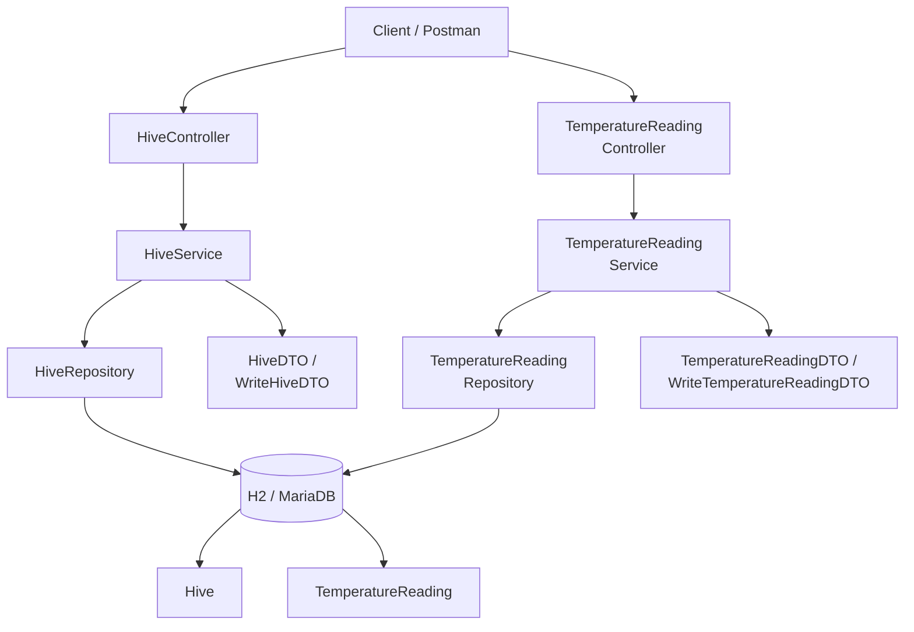

# HiveWatch Lite

## Overview

HiveWatch Lite is a Spring Boot REST application for managing beehives and hive temperature readings.

It was built for the **CT5221 Full Stack App Development** module using a realistic beekeeping domain. The repository currently focuses on the back end and demonstrates layered application structure, REST API design, service-layer business rules, JPA-based persistence, and DTO-based request and response handling.

The next planned stage is a React front end that will consume these APIs and turn the project into a clearer end-to-end full-stack application.

## Why this project matters

This repository is intended to show practical early-career software engineering skills across:

- Java and Spring Boot
- REST API design
- layered architecture using controller, service, repository, entity, and DTO classes
- relational modelling with JPA (Java Persistence API)
- local development workflow using H2
- service-layer validation and business rules beyond thin CRUD only
- preparation for a front-end integration phase

## Current project status

### Implemented so far

- Spring Boot REST API
- Two related entities: `Hive` and `TemperatureReading`
- CRUD operations for both entities
- search and filtering endpoints for hives and readings
- relationship handling between hives and readings
- business-rule validation in the service layer
- H2 in-memory database for development and local testing
- separate MariaDB example configuration for optional future/local use

### Planned next step

- React front end for viewing, creating, editing, deleting, and managing entity relationships through the API

## Domain model

### Hive
Represents a beehive being monitored.

Fields:
- `id`
- `name`
- `location`

### TemperatureReading
Represents a temperature measurement linked to a hive.

Fields:
- `id`
- `temperature`
- `recordedAt`
- `hive`

### Relationship
- one hive can have many temperature readings
- each temperature reading belongs to one hive

## Architecture

This project uses a layered Spring Boot structure with controllers exposing the API, services handling business logic, repositories handling persistence, DTOs shaping request and response payloads, and entities representing the core domain.



## Application layers

### Entities
- `Hive`
- `TemperatureReading`

### DTOs
- `HiveDTO`
- `TemperatureReadingDTO`
- `WriteHiveDTO`
- `WriteTemperatureReadingDTO`

### Repositories
- `HiveRepository`
- `TemperatureReadingRepository`

### Services
- `HiveService` / `HiveServiceImpl`
- `TemperatureReadingService` / `TemperatureReadingServiceImpl`

### Controllers
- `HiveController`
- `TemperatureReadingController`

## Current API capabilities

### Hive endpoints
Base route: `/api/hives`

Implemented operations:
- create a hive
- get all hives
- get hive by id
- update hive
- delete hive
- find hive by exact name
- search hive names by fragment
- search hive locations by fragment
- combined search by name and/or location
- rename hive
- relocate hive

### Temperature reading endpoints
Base route: `/api/readings`

Implemented operations:
- create a reading
- get all readings
- get reading by id
- update reading
- delete reading
- list readings for a hive
- get latest reading for a hive
- get readings for a hive between two timestamps
- count readings for a hive
- calculate average temperature for the last N minutes
- assign a reading to a different hive
- apply a temperature offset across all readings for a hive

## Business rules implemented

### Hive rules
- hive name is required
- hive location is required
- hive name must be 2 to 50 characters
- hive location must be 2 to 80 characters
- hive name must be unique
- a hive cannot be deleted if temperature readings still exist for it

### Temperature reading rules
- `hiveId` is required when creating or updating a reading
- temperature is required
- `recordedAt` is required for update
- temperature must be between `-9.0` and `46.5` degrees Celsius
- `recordedAt` cannot be in the future
- duplicate timestamps for the same hive are blocked
- a reading cannot be reassigned to another hive if that would create a timestamp conflict
- batch offset updates are limited to values between `-20.0` and `+20.0`

## Technology stack

- Java 25 toolchain as currently configured in Gradle
- Spring Boot 3
- Spring Web
- Spring Data JPA
- H2 Database for development and local testing
- MariaDB driver included for optional assignment-target persistence
- Gradle
- Postman for local API testing

## Running the project locally

### Prerequisites
- JDK 25 installed
- Gradle wrapper included in the repository

### Start the application

Windows:

```bash
gradlew.bat bootRun
```

macOS or Linux:

```bash
./gradlew bootRun
```

The project includes a safe local development configuration using an in-memory H2 database, so no additional database setup is required for a basic local run.

## Local development

By default, the application runs on:

`http://localhost:8080`

This project currently exposes REST API endpoints and the H2 console. It does **not** yet include a browser-based home page at the root URL, so a `404` at `http://localhost:8080/` is expected at this stage.

### H2 console (local development only)

`http://localhost:8080/h2-console`

Use the following settings:

- JDBC URL: `jdbc:h2:mem:testdb`
- User Name: `sa`
- Password: blank

> Note: These settings are intended for local development only.

## Example API routes

The following routes were reviewed during local testing. Direct browser testing works well for `GET` routes, while `POST`, `PUT`, and `DELETE` are better tested in Postman.

### Hive routes

```text
GET    /api/hives
GET    /api/hives/1
GET    /api/hives/by-name?name=Hive%20A%20(Queen%202026)
GET    /api/hives/name-contains?name=Hive
GET    /api/hives/location-contains?name=Garden
GET    /api/hives/search?nameFragment=Hive
GET    /api/hives/search?locationFragment=Garden
GET    /api/hives/search?nameFragment=Hive&locationFragment=Garden
POST   /api/hives
PUT    /api/hives/{id}
DELETE /api/hives/{id}
PUT    /api/hives/{id}/rename?name=North%20Hive
PUT    /api/hives/{id}/relocate?location=Orchard
```

### Temperature reading routes

```text
GET    /api/readings
GET    /api/readings/1
GET    /api/readings/hive/1
GET    /api/readings/hive/1/latest
GET    /api/readings/hive/1/count
GET    /api/readings/hive/1/average-last-minutes?minutes=60
GET    /api/readings/hive/1/between?start=2026-03-19T09:00:00&end=2026-03-19T12:00:00
POST   /api/readings
PUT    /api/readings/{id}
DELETE /api/readings/{id}
PUT    /api/readings/{readingId}/assign-hive/{hiveId}
PUT    /api/readings/hive/{hiveId}/apply-offset?delta=0.5
```

## Current evidence

### API proof in Postman

The screenshot below shows the `GET /api/hives` endpoint returning seeded hive data successfully during local testing.


### Persistence proof in H2

The screenshot below shows seeded `HIVE` and `TEMPERATURE_READING` records in the H2 development database.


## What this project already shows to employers

Even before the React stage is added, this repository already demonstrates:

- a realistic domain rather than a generic tutorial app
- a clean layered back-end structure
- RESTful API design with both CRUD and domain-specific operations
- DTO usage for clearer request and response handling
- service-layer validation and business logic
- relational modelling with a one-to-many association
- search, filtering, aggregation, and batch update behaviour
- local development workflow using H2 and Postman

## Planned React front end upgrade

The next planned phase is to add a React front end in line with the CT5221 brief.

The brief requires a front end that uses the back-end APIs and, for each entity class, provides:

- a view of all data
- a way to create a new record
- a way to edit a record
- a way to delete a record
- persistence through the API with the UI refreshed to stay up to date

It also requires that at least one relationship can be created or modified from the front end.

### Planned React scope for HiveWatch Lite

#### Hive views
- view all hives
- create a new hive
- edit hive name and location
- delete hive where allowed by back-end rules
- search hives by name and location

#### Temperature reading views
- view all readings
- create a new reading
- edit a reading
- delete a reading
- filter readings by hive
- view latest reading and recent hive metrics

#### Relationship workflow
At least one relationship workflow will be added through the UI, most likely one of these:
- create a temperature reading directly against a selected hive
- reassign a temperature reading to a different hive

#### Usability improvements planned
- clearer forms and validation messages
- refresh after create, update, and delete actions
- basic navigation between hive and reading views
- a more polished user-facing presentation for demos and employers

## Future improvements beyond the React brief

After the React stage, the strongest follow-on improvements would be:

- automated back-end tests for controllers and services
- front-end tests for React components and API flows
- API documentation with Swagger / OpenAPI
- Docker support for easier local setup
- CI workflow using GitHub Actions
- better exception response structure using JSON error objects
- pagination or sorting for readings
- support for additional sensor data such as humidity, hive weight, or battery status
- deployment of the front end and back end for a live demo version

## Current limitations

To keep the README honest, the following should be noted:

- no React front end has been added yet
- there is no browser-based home page at the root URL yet
- automated test coverage is still minimal
- no CI pipeline is included yet
- no Docker containerisation is included yet
- the current setup is mainly focused on the back end and local development

## Repository structure

```text
src/
  main/
    java/com/hivewatch/hivewatchlite/
      controller/
      dto/
      entity/
      repo/
      service/
    resources/
      application.properties
      application.example.properties
  test/
    java/com/hivewatch/hivewatchlite/
```

## Notes

This README reflects the project as it currently exists in the repository.
The React front end is intentionally described as a planned next stage rather than a completed feature.
