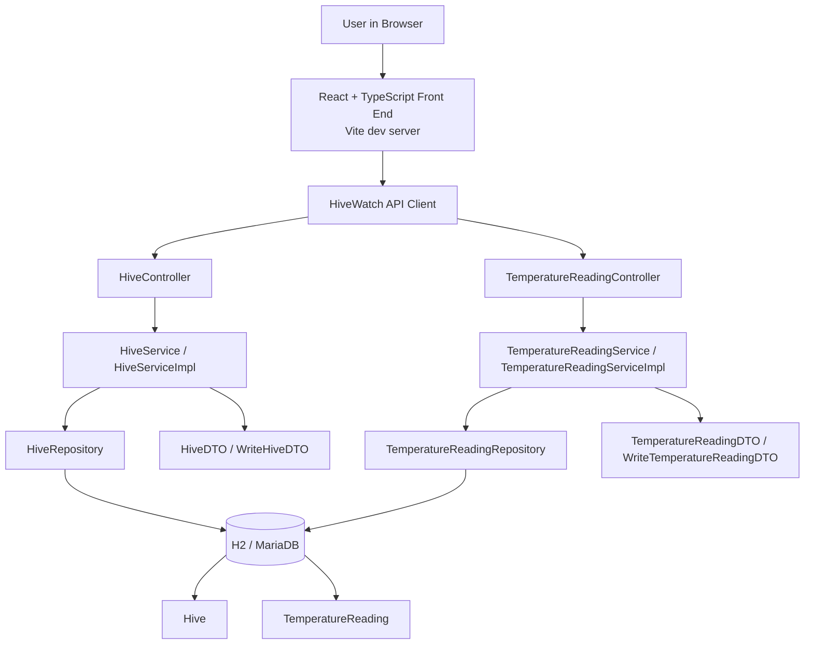
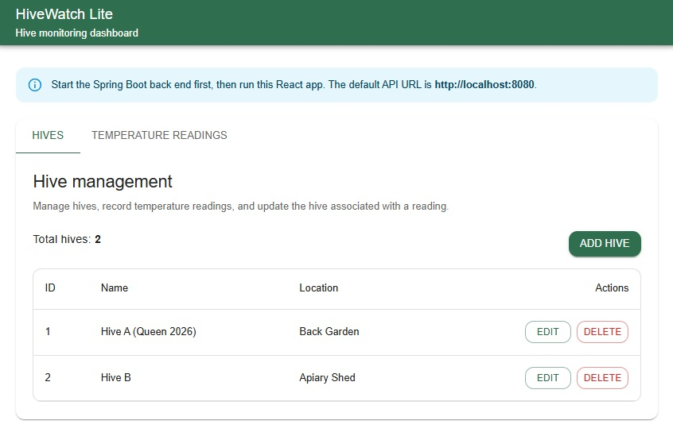
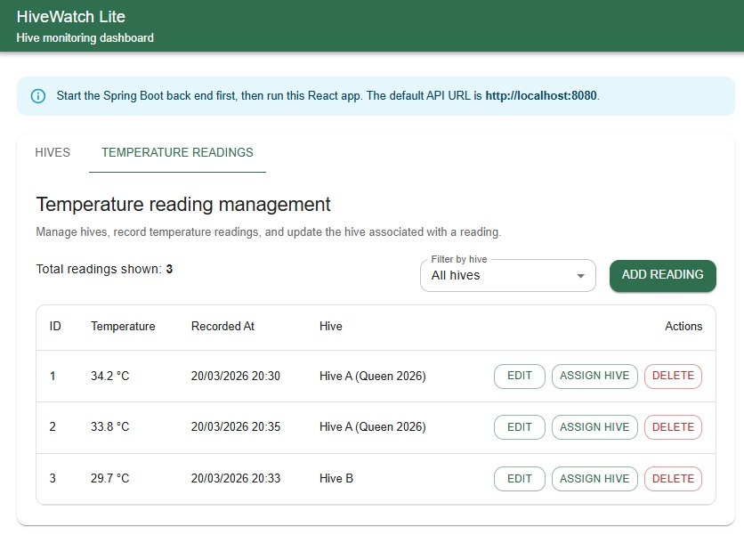
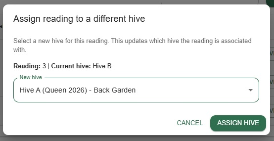

# HiveWatch Lite

HiveWatch Lite is a full-stack beehive monitoring prototype built with a Spring Boot REST API and a React + TypeScript front end.

It was developed for the **CT5221 Full Stack App Development** module using a realistic beekeeping domain. The project manages two related entities:

- `Hive`
- `TemperatureReading`

The application supports CRUD operations for both entities and includes a relationship workflow that allows a temperature reading to be reassigned to a different hive.

---

## Why this project matters

This repository is intended to show practical software development skills across:

- Java and Spring Boot
- React and TypeScript
- REST API design
- layered architecture
- DTO-based request and response handling
- relational modelling with JPA
- front-end and back-end integration
- service-layer validation beyond thin CRUD
- automated back-end testing

---

## Key features

### Back end
- Spring Boot REST API
- layered structure using controller, service, repository, entity, and DTO classes
- H2 in-memory database for local development
- MariaDB example configuration included for optional local or future use

### Front end
- React + TypeScript UI
- forms and tables for hives and readings
- create, edit, delete, and filter workflows
- relationship reassignment through the UI
- consistent displayed date formatting in the UI

### Domain behaviour
- one hive can have many temperature readings
- each temperature reading belongs to one hive
- relationship reassignment is supported
- search, filtering, aggregation, and batch update behaviour are included

---

## Architecture

This project uses a layered full-stack structure. The React front end provides the user interface, calls the Spring Boot REST API, and displays data returned from the back end. The back end uses controllers to expose endpoints, services to apply business logic, repositories to handle persistence, DTOs to shape payloads, and entities to represent the domain model.



---

## Application layers

### Front end
- React
- TypeScript
- Vite
- API client layer for HTTP requests
- reusable UI components

### Back end
- entities: `Hive`, `TemperatureReading`
- DTOs: `HiveDTO`, `TemperatureReadingDTO`, `WriteHiveDTO`, `WriteTemperatureReadingDTO`
- repositories: `HiveRepository`, `TemperatureReadingRepository`
- services: `HiveService`, `HiveServiceImpl`, `TemperatureReadingService`, `TemperatureReadingServiceImpl`
- controllers: `HiveController`, `TemperatureReadingController`

---

## API capabilities

### Hive endpoints
Base route: `/api/hives`

Implemented operations:
- create a hive
- get all hives
- get hive by id
- update hive
- delete hive
- find hive by exact name
- search hive names by fragment
- search hive locations by fragment
- combined search by name and or location
- rename hive
- relocate hive

### Temperature reading endpoints
Base route: `/api/readings`

Implemented operations:
- create a reading
- get all readings
- get reading by id
- update reading
- delete reading
- list readings for a hive
- get latest reading for a hive
- get readings for a hive between two timestamps
- count readings for a hive
- calculate average temperature for the last N minutes
- assign a reading to a different hive
- apply a temperature offset across all readings for a hive

---

## Business rules

### Hive rules
- hive name is required
- hive location is required
- hive name must be 2 to 50 characters
- hive location must be 2 to 80 characters
- hive name must be unique
- a hive cannot be deleted if temperature readings still exist for it

### Temperature reading rules
- `hiveId` is required when creating or updating a reading
- temperature is required
- `recordedAt` is required when recording or updating a reading
- temperature must be between `-9.0` and `46.5` degrees Celsius
- `recordedAt` cannot be in the future
- duplicate timestamps for the same hive are blocked
- a reading cannot be reassigned to another hive if that would create a timestamp conflict
- batch offset updates are limited to values between `-20.0` and `+20.0`

---

## Back-end testing

A layered JUnit testing suite was added to the back end to verify repository behaviour, service-layer business rules, and controller-level HTTP handling.

### Test stack
- JUnit 5
- Mockito
- `@DataJpaTest` with H2 for repository tests
- `@WebMvcTest` with `MockMvc` for controller tests
- Gradle test execution and HTML test reporting

### Test classes
The core layered suite spans six test classes:

- `HiveRepositoryTest`
- `TemperatureReadingRepositoryTest`
- `HiveServiceImplTest`
- `TemperatureReadingServiceImplTest`
- `HiveControllerTest`
- `TemperatureReadingControllerTest`

A previously verified Gradle HTML report showed the baseline layered suite passing with repository, service, and controller coverage in place. Selected parameterized service tests were then added to strengthen validation coverage further.

### What is being verified
The automated tests cover:
- repository queries, ordering, averages, and batch updates
- service-layer business rules such as duplicate hive prevention, blocked delete behaviour, required timestamps, timestamp conflicts, and numeric validation rules
- controller request and response handling, including expected `201`, `200`, `400`, and `409` outcomes

### Boundary-focused testing
Additional boundary-focused service tests were added for selected validation rules, including:
- temperature boundaries
- average window minute boundaries
- offset delta boundaries

### Test traceability
A lightweight requirements-to-test traceability document is included at:

`docs/test-traceability.md`

To view the latest local summary after running the suite, open:

`build/reports/tests/test/index.html`

---

## Technology stack

### Back end
- Java 25 toolchain as configured in Gradle
- Spring Boot 3
- Spring Web
- Spring Data JPA
- H2 Database
- MariaDB driver
- Gradle

### Front end
- React
- TypeScript
- Vite

### Development and testing
- JUnit 5
- Mockito
- Spring `MockMvc`
- H2 in-memory database
- Gradle test execution and HTML test reporting
- Postman
- browser-based UI testing

---

## Running the project locally

### Prerequisites
- JDK 25 installed
- Node.js and npm installed
- Gradle wrapper included in the repository

### Start the back end

From the repository root:

**Windows**
```bash
gradlew.bat bootRun
```

**macOS or Linux**
```bash
./gradlew bootRun
```

The Spring Boot API runs locally at:

```text
http://localhost:8080
```

The project includes a safe local development configuration using an in-memory H2 database, so no additional database setup is required for a basic local run.

### Start the front end

From the `frontend` folder:

```bash
npm install
npm run dev
```

The React front end usually runs locally at:

```text
http://localhost:5173
```

### Run the automated tests

From the repository root:

```bash
gradlew.bat cleanTest test
```

Then open the generated HTML report:

```text
build/reports/tests/test/index.html
```

### Local development notes
- `http://localhost:5173` serves the React front end
- `http://localhost:8080` serves the Spring Boot back end and REST API
- a `404` at `http://localhost:8080/` is expected because the back end exposes the API and H2 console, not a browser home page
- the React app consumes the API from the back end during local development

### H2 console
```text
http://localhost:8080/h2-console
```

Use the following settings:
- JDBC URL: `jdbc:h2:mem:testdb`
- User Name: `sa`
- Password: blank

> These settings are for local development only.

---

## Example routes

Representative routes currently supported by the controller mappings include:

### Hive routes
```text
GET    /api/hives
GET    /api/hives/1
GET    /api/hives/by-name?name=Hive%20A%20(Queen%202026)
GET    /api/hives/name-contains?name=Hive
GET    /api/hives/location-contains?name=Garden
GET    /api/hives/search?nameFragment=Hive
GET    /api/hives/search?locationFragment=Garden
GET    /api/hives/search?nameFragment=Hive&locationFragment=Garden
POST   /api/hives
PUT    /api/hives/{id}
DELETE /api/hives/{id}
PUT    /api/hives/{id}/rename?name=North%20Hive
PUT    /api/hives/{id}/relocate?location=Orchard
```

### Temperature reading routes
```text
GET    /api/readings
GET    /api/readings/1
GET    /api/readings/hive/1
GET    /api/readings/hive/1/latest
GET    /api/readings/hive/1/count
GET    /api/readings/hive/1/average-last-minutes?minutes=60
GET    /api/readings/hive/1/between?start=2026-03-19T09:00:00&end=2026-03-19T12:00:00
POST   /api/readings
PUT    /api/readings/{id}
DELETE /api/readings/{id}
PUT    /api/readings/{readingId}/assign-hive/{hiveId}
PUT    /api/readings/hive/{hiveId}/apply-offset?delta=0.5
```

---

## Evidence

### API proof in Postman


### Persistence proof in H2


### React front end
#### Hives screen


#### Temperature readings screen


#### Relationship update


---

## What this project shows

This repository demonstrates:
- a realistic domain rather than a generic tutorial app
- a clean layered back-end structure
- RESTful API design with both CRUD and domain-specific operations
- DTO usage for clearer request and response handling
- service-layer validation and business logic
- relational modelling with a one-to-many association
- search, filtering, aggregation, and batch update behaviour
- a working React front end connected to a Spring Boot API
- relationship editing through the UI
- local development workflow using H2, Postman, and React
- a layered automated back-end testing approach across repository, service, and controller levels
- boundary-focused automated testing for selected validation rules
- traceability from selected business rules to automated tests

---

## Possible future enhancements

Potential future improvements include:
- add JaCoCo coverage reporting
- optionally add SonarQube quality scanning and a CI quality gate
- expand integration-style API tests for key end-to-end flows
- extend automated testing further as the domain model grows

---

## Repository structure

```text
.
├── docs/
│   ├── images/
│   └── test-traceability.md
├── frontend/
│   ├── src/
│   │   ├── api/
│   │   ├── components/
│   │   └── utils/
│   ├── .env
│   ├── package-lock.json
│   ├── package.json
│   └── vite.config.ts
├── gradle/
│   └── wrapper/
├── src/
│   ├── main/
│   │   ├── java/com/hivewatch/hivewatchlite/
│   │   │   ├── HivewatchliteApplication.java
│   │   │   ├── StartupRunner.java
│   │   │   ├── controller/
│   │   │   ├── dto/
│   │   │   ├── entity/
│   │   │   ├── repo/
│   │   │   └── service/
│   │   └── resources/
│   │       ├── application.example.properties
│   │       └── application.properties
│   └── test/
│       └── java/com/hivewatch/hivewatchlite/
│           ├── controller/
│           ├── repo/
│           └── service/
├── .gitattributes
├── .gitignore
├── HELP.md
├── README.md
├── build.gradle
├── gradlew
├── gradlew.bat
└── settings.gradle
```