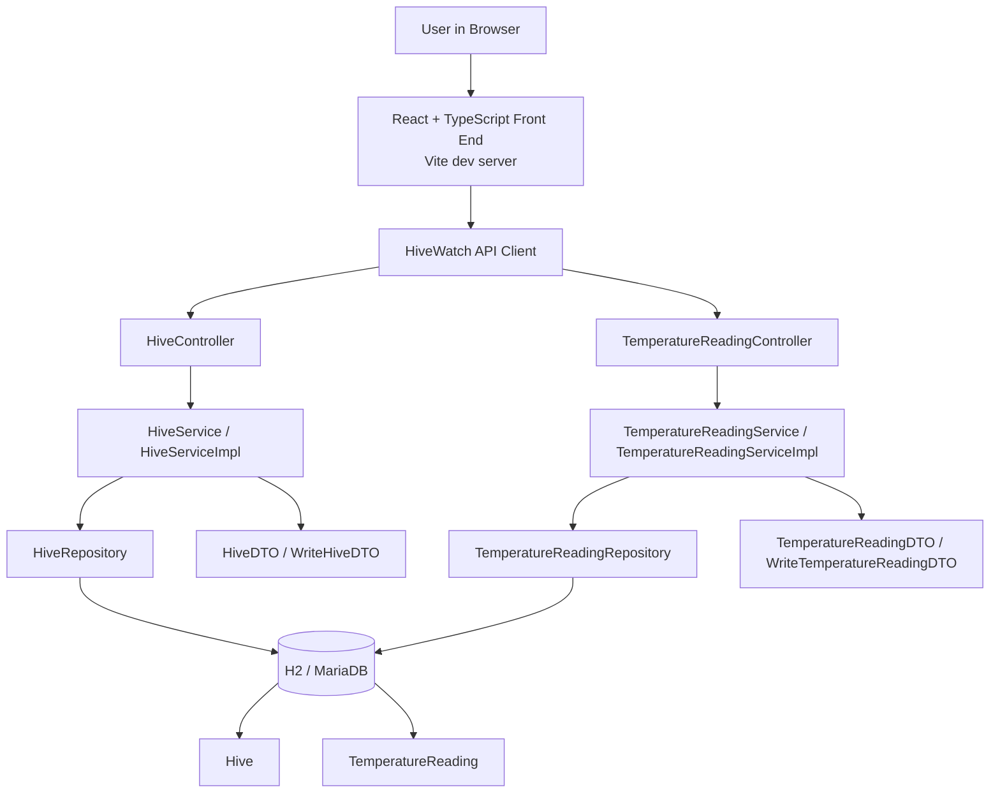
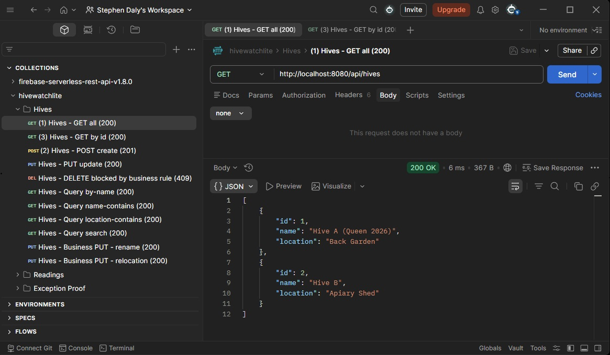
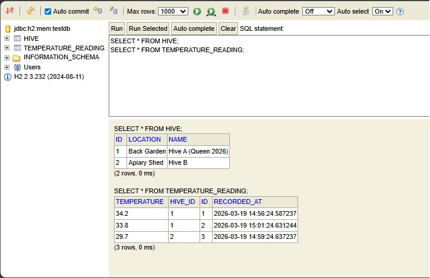

# HiveWatch Lite

## Overview

HiveWatch Lite is a full-stack beehive monitoring prototype built with a Spring Boot REST API and a React + TypeScript front end.

It was built for the **CT5221 Full Stack Application Development** module using a realistic beekeeping domain. The project manages two related entities:

- `Hive`
- `TemperatureReading`

The application supports full CRUD operations for both entities and includes a relationship update workflow that allows a temperature reading to be reassigned to a different hive.

The repository now demonstrates both the back end and the front end of the application, showing API design, service-layer business rules, JPA-based persistence, DTO-based request and response handling, and React-based UI integration.

## Why this project matters

This repository is intended to show practical early-career software engineering skills across:

- Java and Spring Boot
- React and TypeScript
- REST API design
- layered architecture using controller, service, repository, entity, and DTO classes
- relational modelling with JPA (Java Persistence API)
- local development workflow using H2
- front-end and back-end integration
- service-layer validation and business rules beyond thin CRUD only

## Current project status

### Implemented

- Spring Boot REST API
- React + TypeScript front end
- Two related entities: `Hive` and `TemperatureReading`
- CRUD operations for both entities
- search and filtering endpoints for hives and readings
- relationship handling between hives and readings
- relationship reassignment for temperature readings through the UI
- business-rule validation in the service layer
- H2 in-memory database for development and local testing
- separate MariaDB example configuration for optional future/local use

## Domain model

### Hive
Represents a beehive being monitored.

Fields:
- `id`
- `name`
- `location`

### TemperatureReading
Represents a temperature measurement linked to a hive.

Fields:
- `id`
- `temperature`
- `recordedAt`
- `hive`

### Relationship
- one hive can have many temperature readings
- each temperature reading belongs to one hive

## Architecture

This project uses a layered full-stack structure. The React front end provides the user interface, calls the Spring Boot REST API, and displays live data returned from the back end. The back end uses controllers to expose endpoints, services to apply business logic, repositories to handle persistence, DTOs to shape payloads, and entities to represent the domain model.



## Application layers

### Front end
- React
- TypeScript
- Vite
- API client layer for HTTP requests
- reusable components for forms, tables, dialogs, and relationship updates

### Back end entities
- `Hive`
- `TemperatureReading`

### DTOs
- `HiveDTO`
- `TemperatureReadingDTO`
- `WriteHiveDTO`
- `WriteTemperatureReadingDTO`

### Repositories
- `HiveRepository`
- `TemperatureReadingRepository`

### Services
- `HiveService` / `HiveServiceImpl`
- `TemperatureReadingService` / `TemperatureReadingServiceImpl`

### Controllers
- `HiveController`
- `TemperatureReadingController`

## Current API capabilities

### Hive endpoints
Base route: `/api/hives`

Implemented operations:
- create a hive
- get all hives
- get hive by id
- update hive
- delete hive
- find hive by exact name
- search hive names by fragment
- search hive locations by fragment
- combined search by name and/or location
- rename hive
- relocate hive

### Temperature reading endpoints
Base route: `/api/readings`

Implemented operations:
- create a reading
- get all readings
- get reading by id
- update reading
- delete reading
- list readings for a hive
- get latest reading for a hive
- get readings for a hive between two timestamps
- count readings for a hive
- calculate average temperature for the last N minutes
- assign a reading to a different hive
- apply a temperature offset across all readings for a hive

## Front-end capabilities

### Hive views
- view all hives
- create a new hive
- edit hive name and location
- delete a hive where allowed by back-end rules

### Temperature reading views
- view all readings
- create a new reading
- edit a reading
- delete a reading
- filter readings by hive

### Relationship workflow
- reassign a temperature reading to a different hive using the **Assign Hive** action

### Usability improvements implemented
- front-end forms and validation feedback
- refresh after create, update, delete, and relationship change actions
- basic navigation between hive and reading views
- clearer user-facing presentation for demos and portfolio review
- consistent displayed date format in the UI using `dd/mm/yyyy`

## Business rules implemented

### Hive rules
- hive name is required
- hive location is required
- hive name must be 2 to 50 characters
- hive location must be 2 to 80 characters
- hive name must be unique
- a hive cannot be deleted if temperature readings still exist for it

### Temperature reading rules
- `hiveId` is required when creating or updating a reading
- temperature is required
- `recordedAt` is required for update
- temperature must be between `-9.0` and `46.5` degrees Celsius
- `recordedAt` cannot be in the future
- duplicate timestamps for the same hive are blocked
- a reading cannot be reassigned to another hive if that would create a timestamp conflict
- batch offset updates are limited to values between `-20.0` and `+20.0`

## Technology stack

### Back end
- Java 25 toolchain as currently configured in Gradle
- Spring Boot 3
- Spring Web
- Spring Data JPA
- H2 Database for development and local testing
- MariaDB driver included for optional assignment-target persistence
- Gradle

### Front end
- React
- TypeScript
- Vite

### Development and testing
- Postman for local API testing
- browser-based testing of the React UI
- H2 console for development database inspection

## Running the project locally

### Prerequisites
- JDK 25 installed
- Node.js and npm installed
- Gradle wrapper included in the repository

### Start the back end

From the repository root:

Windows:

```bash
gradlew.bat bootRun
```

macOS or Linux:

```bash
./gradlew bootRun
```

The Spring Boot API runs locally at:

```text
http://localhost:8080
```

The project includes a safe local development configuration using an in-memory H2 database, so no additional database setup is required for a basic local run.

### Start the front end

From the `frontend` folder:

```bash
npm install
npm run dev
```

The React front end usually runs locally at:

```text
http://localhost:5173
```

### Local development notes

- `http://localhost:5173` serves the React front end
- `http://localhost:8080` serves the Spring Boot back end and REST API
- a `404` at `http://localhost:8080/` is expected because the back end exposes the API and H2 console, not a browser home page
- the React app consumes the API from the back end during local development

### H2 console (local development only)

```text
http://localhost:8080/h2-console
```

Use the following settings:

- JDBC URL: `jdbc:h2:mem:testdb`
- User Name: `sa`
- Password: blank

> Note: These settings are intended for local development only.

## Example API routes

The following example routes are supported by the current controller mappings. Representative GET routes were tested locally in the browser and Postman, while POST, PUT, and DELETE operations are intended to be tested in Postman or through the React front end.

### Hive routes

```text
GET    /api/hives
GET    /api/hives/1
GET    /api/hives/by-name?name=Hive%20A%20(Queen%202026)
GET    /api/hives/name-contains?name=Hive
GET    /api/hives/location-contains?name=Garden
GET    /api/hives/search?nameFragment=Hive
GET    /api/hives/search?locationFragment=Garden
GET    /api/hives/search?nameFragment=Hive&locationFragment=Garden
POST   /api/hives
PUT    /api/hives/{id}
DELETE /api/hives/{id}
PUT    /api/hives/{id}/rename?name=North%20Hive
PUT    /api/hives/{id}/relocate?location=Orchard
```

### Temperature reading routes

```text
GET    /api/readings
GET    /api/readings/1
GET    /api/readings/hive/1
GET    /api/readings/hive/1/latest
GET    /api/readings/hive/1/count
GET    /api/readings/hive/1/average-last-minutes?minutes=60
GET    /api/readings/hive/1/between?start=2026-03-19T09:00:00&end=2026-03-19T12:00:00
POST   /api/readings
PUT    /api/readings/{id}
DELETE /api/readings/{id}
PUT    /api/readings/{readingId}/assign-hive/{hiveId}
PUT    /api/readings/hive/{hiveId}/apply-offset?delta=0.5
```

## Current evidence

### API proof in Postman
The screenshot below shows the `GET /api/hives` endpoint returning seeded hive data successfully during local testing.



### Persistence proof in H2
The screenshot below shows seeded `HIVE` and `TEMPERATURE_READING` records in the H2 development database.



## What this project already shows to employers

This repository demonstrates:

- a realistic domain rather than a generic tutorial app
- a clean layered back-end structure
- RESTful API design with both CRUD and domain-specific operations
- DTO usage for clearer request and response handling
- service-layer validation and business logic
- relational modelling with a one-to-many association
- search, filtering, aggregation, and batch update behaviour
- a working React front end connected to a Spring Boot API
- relationship editing through the UI
- local development workflow using H2, Postman, and React

## Roadmap

Planned next steps for the project:

- add JUnit tests for the repository, service, and controller layers
- cover CRUD behaviour, search flows, and update operations across both entities
- verify exception handling for invalid input, duplicates, future timestamps, and blocked deletes
- add tests for relationship operations such as assigning a temperature reading to a different hive

## Repository structure

```text
frontend/
  src/
    api/
    components/
    utils/
  .env
  package.json
  package-lock.json
  vite.config.ts

src/
  main/
    java/com/hivewatch/hivewatchlite/
      controller/
      dto/
      entity/
      repo/
      service/
    resources/
      application.properties
      application.example.properties
  test/
    java/com/hivewatch/hivewatchlite/

docs/
  images/
```